# projet-ms-2-ecomApp

## 1.Créer le micro-service customer-service qui permet de gérer les client

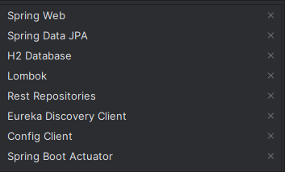

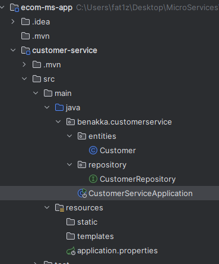

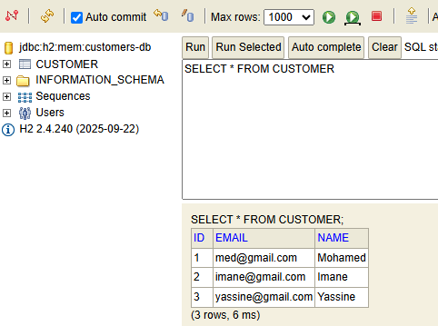

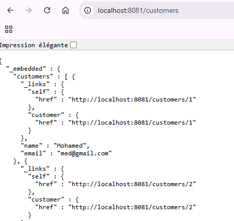

## 2.Créer le micro-service inventory-service qui permet de gérer les produits

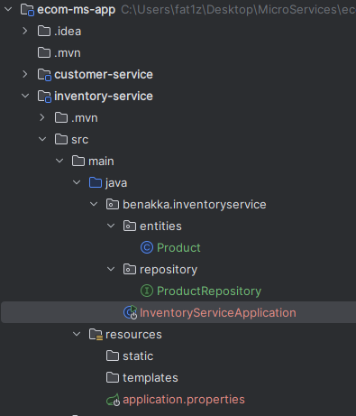

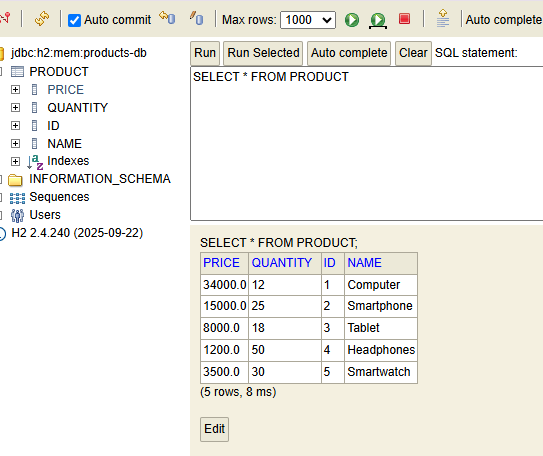

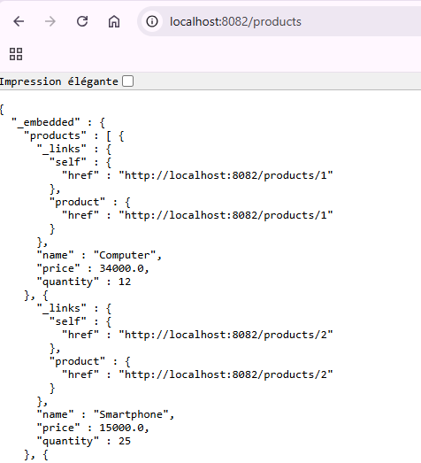

### Actuator

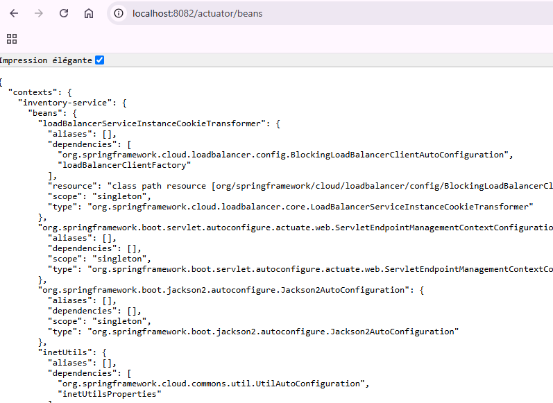

## 3. Créer la Gateway Spring cloud Gateway

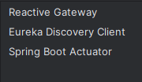

## 4. Configuration statique du système de routage

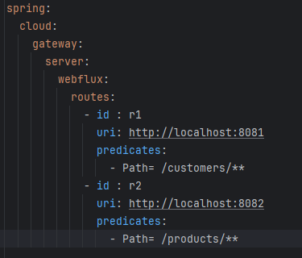

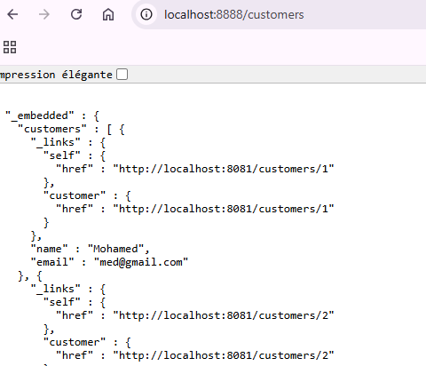

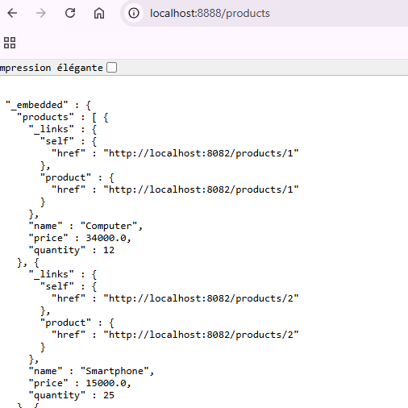

## 5. Créer l'annuaire Eureka Discrovery Service

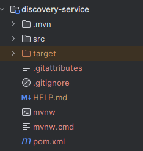

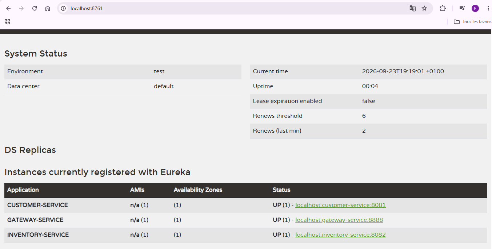

### Fichier yml
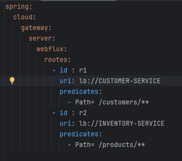

### Bean RouteLocator
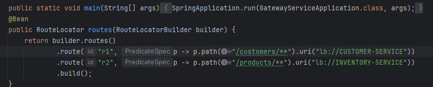

## 6. Faire une configuration dynamique des routes de la gateway

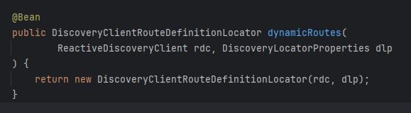

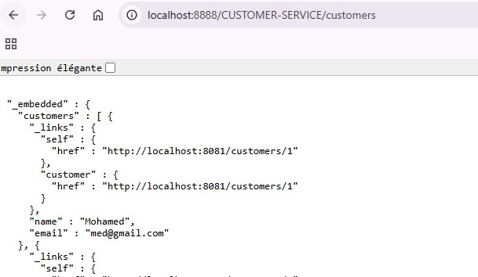

## 7. Créer le service de facturation Billing-Service en utilisant Open Feign

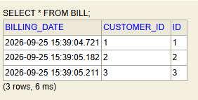

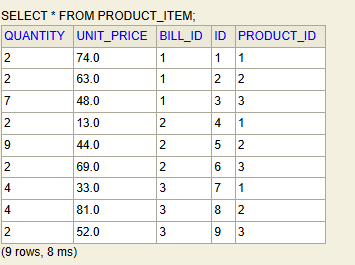

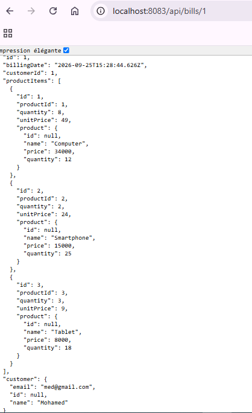

### CircuitBreaker
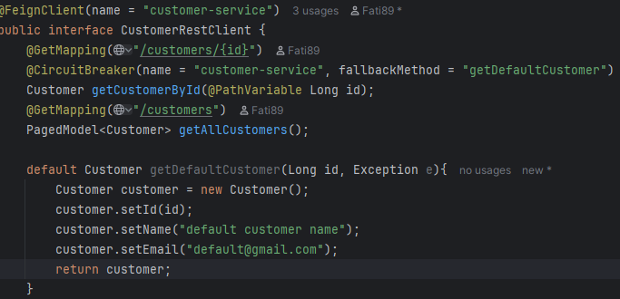

### Tolérance au pannes (Resilience()
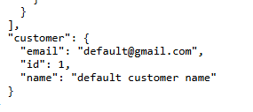

## 8. Créer le service de configuration         
## 9. Créer un client Angular